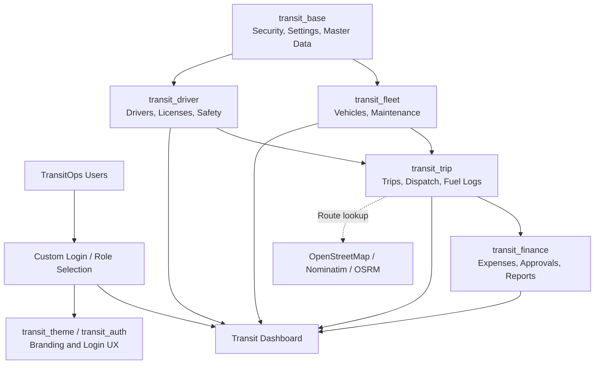
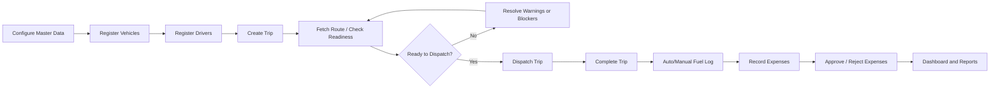

# TransitOps BHAN

TransitOps BHAN is a modular Odoo 19 transport operations platform for managing fleet assets, drivers, dispatch workflows, fuel logs, maintenance, expenses, and operational KPIs from one role-based back-office application.

The project is organized as a set of Odoo addons so each business area can be installed, extended, and maintained independently while sharing a common TransitOps security and master-data layer.

## System Architecture



## Features

- Fleet registry with vehicle lifecycle states, capacity tracking, odometer readings, fuel type, acquisition cost, and maintenance history.
- Driver management with license category, license expiry validation, safety score, availability status, profile photo, and trip statistics.
- Trip dispatch workflow with draft, dispatched, completed, and cancelled states.
- Dispatch readiness scoring based on vehicle availability, active maintenance, driver status, license validity, safety score, cargo capacity, and route data.
- Route utilities using OpenStreetMap/Nominatim geocoding and OSRM driving distance, with coordinate parsing and straight-line fallback support.
- Fuel logging with trip linkage, vehicle linkage, odometer reading, fuel type, and total cost computation.
- Expense management with approval/rejection workflow, receipt storage, payment method, trip context, suggested fuel amount, variance, and similar expense history.
- Maintenance workflow for scheduled, unscheduled, repair, inspection, oil, tire, brake, and other service records.
- KPI dashboard for fleet status, trip performance, driver compliance, fuel cost, approved expenses, maintenance cost, operating cost, distance, cargo, and recent trips.
- Financial report wizard for fuel efficiency, fleet utilization, operational cost, vehicle ROI, maintenance cost, driver performance, and summary reporting.
- Role-based access control for fleet managers, drivers, safety officers, and financial analysts.
- Optional branded login/theme modules for a TransitOps-specific user experience.

## Addon Overview

| Addon | Purpose | Depends On |
| --- | --- | --- |
| `transit_base` | Core TransitOps security groups, master data, configuration settings, vehicle types, and license categories. | `base`, `mail`, `base_setup` |
| `transit_fleet` | Vehicle registry and maintenance management. | `transit_base`, `mail` |
| `transit_driver` | Driver profiles, license compliance, safety score, and driver trip stats. | `transit_base`, `mail` |
| `transit_trip` | Trip creation, dispatch lifecycle, route distance tools, fuel logs, and trip operational metrics. | `transit_fleet`, `transit_driver` |
| `transit_finance` | Expenses, approval workflow, operational analytics, and report wizard. | `transit_trip` |
| `transit_dashboard` | Real-time operational dashboard and smart navigation actions. | `transit_base`, `transit_fleet`, `transit_driver`, `transit_trip`, `transit_finance` |
| `transit_auth` | Custom Odoo login extension with role assignment after login. | `web`, `transit_base` |
| `transit_theme` | Optional TransitOps dark UI styling and branded login page. | `web`, `transit_base`, `transit_dashboard` |

## Business Workflow



1. Configure TransitOps master data in `TransitOps > Configuration`.
2. Create vehicle types and driver license categories.
3. Register vehicles with registration number, load capacity, odometer, fuel type, status, and acquisition cost.
4. Register drivers with license details, license expiry date, safety score, contact information, and availability status.
5. Create a trip with source, destination, vehicle, driver, cargo weight, and planned distance.
6. Optionally fetch coordinates, route distance, or open the trip route in OpenStreetMap.
7. Review dispatch readiness before dispatching.
8. Dispatch the trip. The selected vehicle and driver move to `On Trip`.
9. Complete the trip by entering final odometer and fuel consumed. The system updates vehicle odometer, releases vehicle/driver availability, and can auto-create a fuel log.
10. Record trip expenses and approve or reject them through the finance workflow.
11. Monitor dashboard KPIs and generate reports for operational review.

## Roles and Access

TransitOps defines four core security groups:

| Role | Typical Access |
| --- | --- |
| Fleet Manager | Full operational access to master data, vehicles, maintenance, trips, fuel logs, expenses, reports, and dashboard. |
| Driver | Read access to driver records, create/update access for assigned operational records such as trips, fuel logs, and expenses where permitted. |
| Safety Officer | Read-focused access to vehicles, drivers, trips, dashboard, and create/update access for maintenance and safety-related expense records where permitted. |
| Financial Analyst | Access to expenses, reports, finance menus, and read access to operational data required for analysis. |

The base module also adds multi-company record rules for vehicle types and license categories.

## Installation

### Prerequisites

- Odoo 19
- Python runtime supported by your Odoo 19 installation
- PostgreSQL configured for Odoo
- Access to the Odoo addons path where these modules will be loaded

### Add the modules to Odoo

Clone or copy this repository into an Odoo custom addons directory:

```bash
git clone <repository-url> Odoo-hackton-TransitOps-BHAN_DEV
```

Add the directory to your Odoo addons path. Example:

```bash
odoo-bin \
  -d <database_name> \
  --addons-path=/path/to/odoo/addons,/path/to/Odoo-hackton-TransitOps-BHAN_DEV
```

Update the Odoo app list, then install the modules in this order:

1. `Transit Base`
2. `Transit Fleet`
3. `Transit Driver`
4. `Transit Trip`
5. `Transit Finance`
6. `Transit Dashboard`
7. `Transit Auth` optional
8. `TransitOps Theme` optional

Because `transit_trip` is marked as an application module, installing it from Apps will also bring in its required fleet and driver dependencies.

## Configuration

After installation, open `TransitOps > Configuration` and review:

- Vehicle Types
- License Categories
- TransitOps settings in Odoo general settings

The base settings model currently includes:

- `Fuel Cost Per Liter`
- `License Expiry Reminder Days`
- `Weather API Key`

Seed data is included for vehicle types and license categories under `transit_base/data`.

## External Services

Trip route helpers use public map services:

- Nominatim for geocoding source and destination names.
- OSRM for driving route distance.
- OpenStreetMap for opening directions in a browser.

If external service access is unavailable, the trip module supports direct coordinate input and falls back to straight-line distance where route distance cannot be fetched.

## Project Structure

```text
.
├── transit_base/       # Master data, TransitOps roles, settings, seed data
├── transit_fleet/      # Vehicles and maintenance
├── transit_driver/     # Driver profiles and license compliance
├── transit_trip/       # Trips, dispatch lifecycle, route tools, fuel logs
├── transit_finance/    # Expenses, approvals, reports, analytics
├── transit_dashboard/  # KPI dashboard and navigation actions
├── transit_auth/       # Login role selector and dynamic role assignment
└── transit_theme/      # Optional dark theme and branded login styling
```

Each addon follows standard Odoo structure:

- `__manifest__.py` for metadata and dependencies
- `models/` for business models
- `views/` for form, list, search, menu, and dashboard views
- `security/` for access control and record rules
- `data/` for seed/demo-style operational master data where applicable
- `static/` for CSS assets

## Key Models

| Model | Description |
| --- | --- |
| `transit.vehicle.type` | Vehicle master type with company-specific uniqueness. |
| `transit.license.category` | Driver license category with company-specific uniqueness. |
| `transit.vehicle` | Vehicle registry with status, capacity, odometer, maintenance, trip, and fuel-log stats. |
| `transit.maintenance` | Vehicle maintenance records with workflow actions and vehicle status synchronization. |
| `transit.driver` | Driver profile, license validation, safety score, and trip counters. |
| `transit.trip` | Dispatch record with routing helpers, readiness checks, cost metrics, and lifecycle actions. |
| `transit.fuel.log` | Fuel transaction linked to vehicle and optionally to a trip. |
| `transit.expense` | Operational expense with approval workflow and trip cost context. |
| `transit.report` | Transient report wizard for fleet and finance analytics. |
| `transit.dashboard` | Computed KPI model for operational dashboard cards and navigation actions. |

## Development Notes

- The modules use Odoo ORM models, computed fields, constraints, object buttons, smart buttons, menu actions, and access CSV files.
- Most operational models inherit `mail.thread` for chatter and status tracking.
- Vehicle, driver, and trip states are synchronized through workflow actions rather than background jobs.
- Trip names are generated using the `transit.trip` sequence defined in `transit_trip/data/ir_sequence.xml`.
- Route helpers make outbound HTTP requests from the Odoo server process.
- The current codebase does not include automated tests; validate changes by updating the app list, upgrading affected modules, and exercising the main workflows in Odoo.

## Upgrade Commands

During development, restart Odoo and upgrade changed modules from the command line:

```bash
odoo-bin \
  -d <database_name> \
  --addons-path=/path/to/odoo/addons,/path/to/Odoo-hackton-TransitOps-BHAN_DEV \
  -u transit_base,transit_fleet,transit_driver,transit_trip,transit_finance,transit_dashboard
```

If working on the optional login or theme modules, include them as needed:

```bash
odoo-bin \
  -d <database_name> \
  --addons-path=/path/to/odoo/addons,/path/to/Odoo-hackton-TransitOps-BHAN_DEV \
  -u transit_auth,transit_theme
```

## License

All addon manifests declare the project license as `LGPL-3`.
